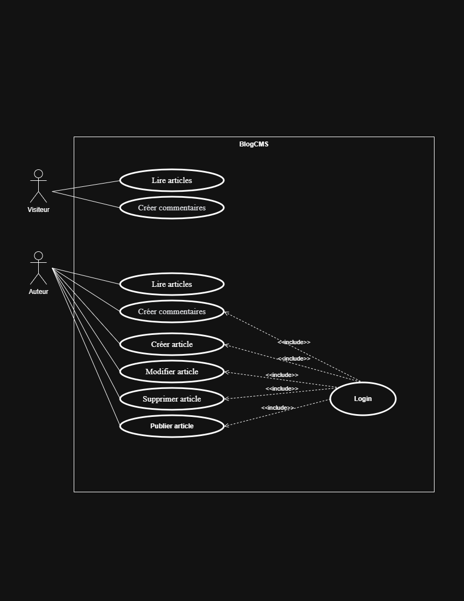
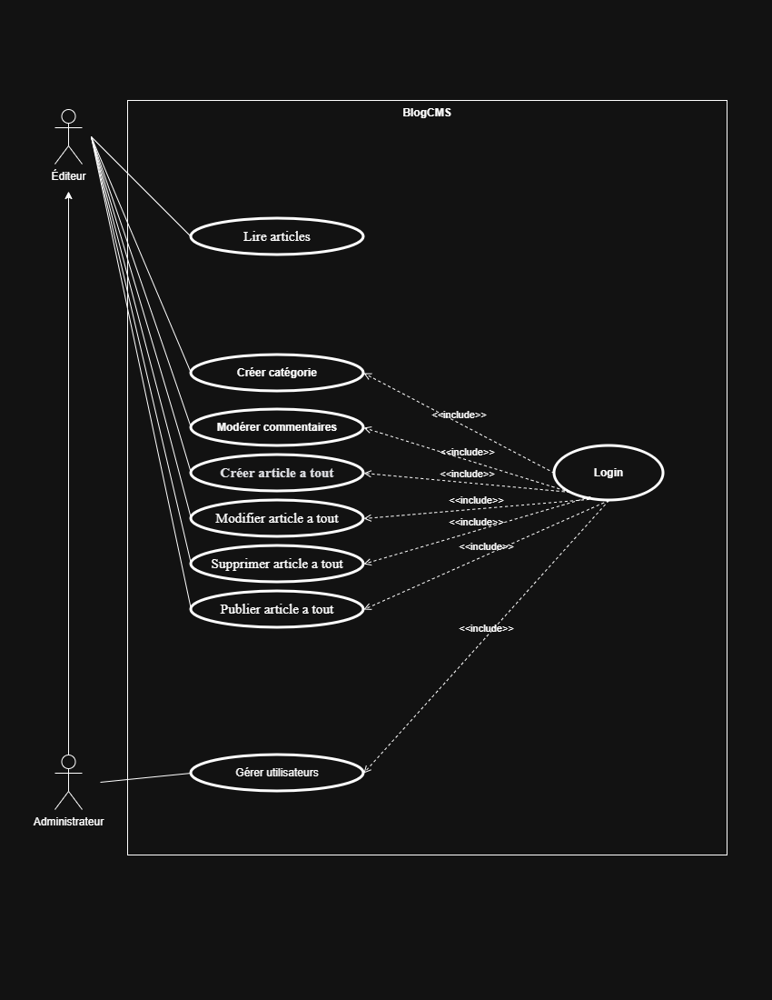

# 📘 BlogCMS - Console Edition

**BlogCMS** est un système de gestion de contenu (CMS) fonctionnant entièrement en **ligne de commande (CLI)**. 
Développé en **PHP Natif (POO)**, ce projet simule l'architecture backend d'un blog d'entreprise pour l'agence fictive *CodeCrafters Digital*.

---

## 🚀 Contexte du Projet
L'entreprise *MediaPress International* a besoin d'un outil interne robuste pour gérer ses articles, catégories et utilisateurs sans passer par une interface web complexe.

**Objectifs techniques :**
* Architecture **100% Orientée Objet** (Héritage, Polymorphisme, Encapsulation).
* Aucun Framework, aucun HTML/CSS.
* Système de permissions basé sur des rôles (RBAC).

---

## 👥 Les Rôles (Personas)

Le système gère 4 niveaux d'accès hiérarchiques :

1.  **Visiteur** : Lecture seule des articles.
2.  **Auteur** : Gestion de *ses* propres articles.
3.  **Éditeur** : Gestion de *tous* les articles, catégories et commentaires.
4.  **Admin** : Accès total, y compris la gestion des utilisateurs.

---

## 📊 Conception (UML)

### 1. Diagramme de Use Cases (Cas d'Utilisation)
Ce diagramme détaille les actions possibles pour chaque acteur du système, en respectant la matrice des permissions.

*(Remplacez 'path/to/your/image.png' par le chemin réel de ton image dans le dossier du projet)*

---

## 🛠️ Stack Technique

* **Langage :** PHP 8+ (Mode CLI)
* **Base de données :** MySQL / PDO
* **Architecture :** MVC (Adapté pour Console)
* **Outils :** Git, UML

---

## 📝 Auteur
**Zakarya Hari** - Développeur Backend Junior
*Projet réalisé dans le cadre de la formation YouCode.*
